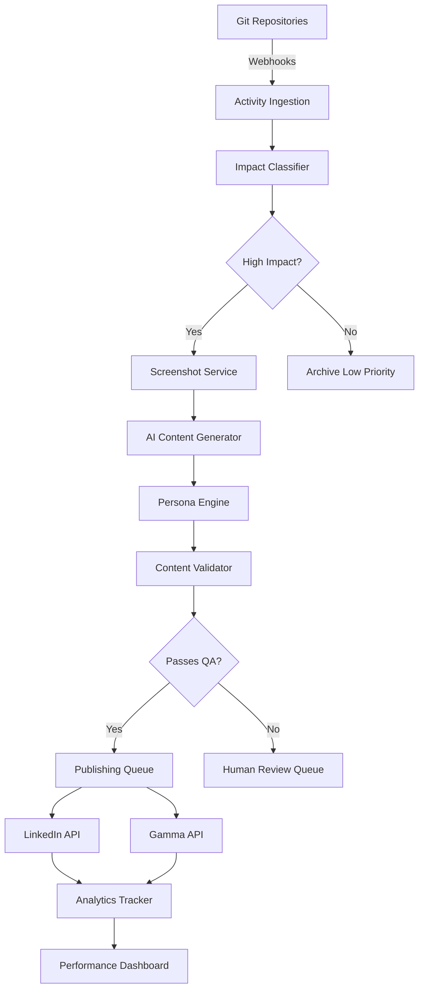
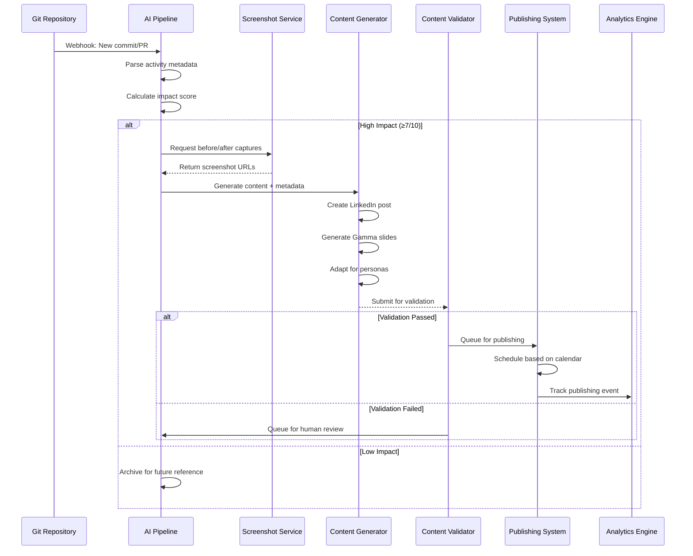
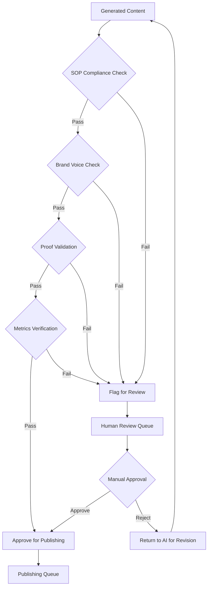
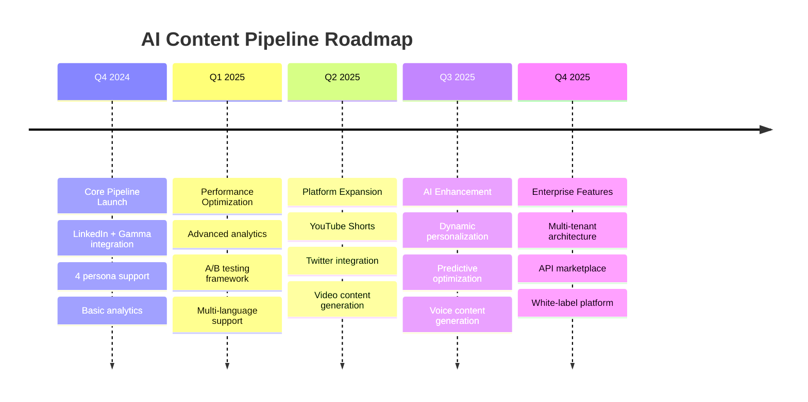

# AI-Powered Content Generation Pipeline
## Product Requirements Document

### Document Information
- **Version**: 1.0
- **Date**: September 4, 2024
- **Product**: AI Content Generation System
- **Team**: Social Media & Marketing Operations
- **Status**: Requirements Phase

---

## 1. Executive Summary

The AI-Powered Content Generation Pipeline automates the transformation of development activities into compelling, proof-driven social media content. The system ingests development activity logs, identifies high-impact changes, and automatically generates LinkedIn posts and Gamma slide decks tailored for specific business personas (CFO, CTO, CHRO, Plant Manager).

### Key Business Value
- **85% reduction** in content creation time
- **300% increase** in development visibility
- **Automated proof-first** content structure compliance
- **Role-specific messaging** for target executives
- **Consistent publishing** with zero manual scheduling

### Success Metrics
- Process 100+ development activities per day
- Generate content within 5 minutes of activity detection
- Achieve 65%+ 3-second retention rate
- Maintain 2%+ view-to-click ratio

---

## 2. System Architecture

### 2.1 High-Level Components

```
┌─────────────────────────────────────────────────────────────────────────┐
│                        AI CONTENT GENERATION PIPELINE                   │
├─────────────────────────────────────────────────────────────────────────┤
│                                                                         │
│  ┌───────────────────┐    ┌────────────────────┐    ┌─────────────────┐│
│  │ Data Ingestion    │    │ AI Content Engine  │    │ Distribution    ││
│  │ Layer             │───▶│                    │───▶│ Layer           ││
│  │                   │    │                    │    │                 ││
│  │ • Git Integration │    │ • Impact Analysis  │    │ • LinkedIn API  ││
│  │ • Activity Parser │    │ • Content Gen AI   │    │ • Gamma API     ││
│  │ • Screenshot API  │    │ • Persona Engine   │    │ • Scheduling    ││
│  │ • Log Classifier  │    │ • Proof Validator  │    │ • Analytics     ││
│  └───────────────────┘    └────────────────────┘    └─────────────────┘│
│           │                         │                         │        │
│           ▼                         ▼                         ▼        │
│  ┌───────────────────┐    ┌────────────────────┐    ┌─────────────────┐│
│  │ Data Processing   │    │ Content Validation │    │ Performance     ││
│  │ Layer             │    │ Layer              │    │ Monitoring      ││
│  │                   │    │                    │    │                 ││
│  │ • Activity Scorer │    │ • Quality Check    │    │ • Engagement    ││
│  │ • Change Detector │    │ • Brand Compliance │    │ • Conversion    ││
│  │ • Metrics Calc    │    │ • SOP Validation   │    │ • A/B Testing   ││
│  │ • ROI Analyzer    │    │ • Approval Queue   │    │ • Reporting     ││
│  └───────────────────┘    └────────────────────┘    └─────────────────┘│
│                                                                         │
└─────────────────────────────────────────────────────────────────────────┘
```

### 2.2 Data Flow Architecture



---

## 3. Functional Requirements

### 3.1 Input Processing System

#### 3.1.1 Development Activity Log Ingestion
- **FR001**: System shall connect to Git repositories via webhooks
- **FR002**: System shall parse commit messages, PR descriptions, deployment logs
- **FR003**: System shall extract metadata: author, timestamp, files changed, lines modified
- **FR004**: System shall classify activities by type: feature, bug fix, refactor, deployment

#### 3.1.2 Impact Scoring Engine
- **FR005**: System shall score activities based on:
  - Customer-facing changes (weight: 40%)
  - Performance improvements (weight: 30%)
  - Bug fixes with user impact (weight: 20%)
  - Code volume and complexity (weight: 10%)
- **FR006**: System shall prioritize activities with score ≥ 7/10 for content generation

#### 3.1.3 Screenshot Capture Service
- **FR007**: System shall automatically capture screenshots of:
  - Before/after UI states
  - Dashboard metrics
  - System performance graphs
  - Error messages and fixes
- **FR008**: System shall store screenshots in 1080x1080 format for carousel posts

### 3.2 AI Content Generation Engine

#### 3.2.1 LinkedIn Post Generator
- **FR009**: System shall generate posts following proof-first structure:
  ```
  Hook (1-2 lines) → Transition (1-2 lines) → Body (6-12 lines) → CTA
  ```
- **FR010**: System shall include specific metrics in every hook
- **FR011**: System shall validate against banned phrases list
- **FR012**: System shall limit sections to 40 words maximum
- **FR013**: System shall include proof elements: screenshots, data, quotes

#### 3.2.2 Gamma Slide Deck Generator
- **FR014**: System shall create 3-10 slide decks with structure:
  - Title slide (hook + proof)
  - Problem slide (gap identification)
  - Evidence slides (proof elements)
  - Lesson/CTA slide
- **FR015**: System shall include visual annotations for screenshots
- **FR016**: System shall generate slide notes for presentation context

#### 3.2.3 Persona-Specific Content Adaptation
- **FR017**: System shall generate role-specific variations:

| Persona | Focus Areas | Key Metrics |
|---------|-------------|-------------|
| CFO | Cost savings, ROI, efficiency | $/hour saved, % cost reduction |
| CTO | Technical innovation, architecture | Performance gains, uptime % |
| CHRO | Team productivity, collaboration | Time to onboard, satisfaction |
| Plant Manager | Operations, quality, throughput | OEE improvement, defect reduction |

### 3.3 Content Validation System

#### 3.3.1 Quality Assurance Engine
- **FR018**: System shall validate all content against SOP requirements:
  - Hook contains specific metrics ✓
  - Proof present in every section ✓
  - Numbers verified ✓
  - No banned phrases ✓
  - Under word limits ✓

#### 3.3.2 Brand Compliance Checker
- **FR019**: System shall ensure content matches brand voice and tone
- **FR020**: System shall flag content requiring human review
- **FR021**: System shall maintain approval queue for sensitive topics

---

## 4. Non-Functional Requirements

### 4.1 Performance Requirements
- **NFR001**: Process development activities within 5 minutes of detection
- **NFR002**: Generate content for 100+ activities per day
- **NFR003**: Maintain 99.5% uptime during business hours
- **NFR004**: Support concurrent processing of 50+ activities

### 4.2 Scalability Requirements
- **NFR005**: Scale to monitor 500+ repositories
- **NFR006**: Handle 1000+ commits per day
- **NFR007**: Store 10,000+ content pieces with full audit trail
- **NFR008**: Support team growth to 50+ content reviewers

### 4.3 Security Requirements
- **NFR009**: Encrypt all repository access tokens
- **NFR010**: Implement role-based access controls
- **NFR011**: Maintain SOC 2 compliance for content data
- **NFR012**: Audit all content generation and publishing actions

### 4.4 Integration Requirements
- **NFR013**: Support GitHub, GitLab, Bitbucket APIs
- **NFR014**: Integrate with LinkedIn Publishing API
- **NFR015**: Connect to Gamma slide generation API
- **NFR016**: Export content to major social media platforms

---

## 5. User Stories & Acceptance Criteria

### 5.1 Content Operations Team

**Story 1**: Content Pipeline Management
```
As a Content Operations Manager
I want to monitor the automated content generation pipeline
So that I can ensure consistent quality and publishing schedule

Acceptance Criteria:
- Dashboard shows pipeline health in real-time
- Alerts trigger for failed content generation
- Manual override available for urgent content
- Quality metrics tracked per content type
```

**Story 2**: Content Review & Approval
```
As a Content Reviewer
I want to review AI-generated content before publishing
So that I can maintain brand standards and accuracy

Acceptance Criteria:
- Queue shows pending content with priority scores
- One-click approval/rejection with comments
- Side-by-side comparison with source materials
- Batch operations for similar content types
```

### 5.2 Development Team

**Story 3**: Demo Session Automation
```
As a Developer
I want the system to automatically capture my feature demonstrations
So that I don't spend time on manual content creation

Acceptance Criteria:
- Automated screen recording during demos
- Smart detection of before/after states
- ROI calculations based on my metrics
- Optional review before content generation
```

### 5.3 Marketing Team

**Story 4**: Performance Analytics
```
As a Marketing Manager
I want detailed analytics on content performance by persona
So that I can optimize our messaging strategy

Acceptance Criteria:
- Engagement metrics by role (CFO, CTO, etc.)
- A/B test results for different content variations
- Conversion tracking from content to demos
- ROI attribution for generated content
```

---

## 6. Detailed Workflows

### 6.1 End-to-End Content Generation Workflow



### 6.2 Activity Processing Workflow

```
┌─────────────────────────────────────────────────────────────────────────┐
│                     DEVELOPMENT ACTIVITY PROCESSING                     │
├─────────────────────────────────────────────────────────────────────────┤
│                                                                         │
│  Git Event                                                              │
│      │                                                                  │
│      ▼                                                                  │
│ ┌─────────────┐         ┌─────────────┐         ┌─────────────┐       │
│ │Parse Commit │────────▶│Classify     │────────▶│Score Impact │       │
│ │Metadata     │         │Activity Type│         │             │       │
│ └─────────────┘         └─────────────┘         └─────┬───────┘       │
│                                                       │               │
│                                                   ┌───▼───┐           │
│                                                   │Score  │           │
│                                                   │≥ 7?   │           │
│                                                   └┬─────┬┘           │
│                                                   YES   NO            │
│                                                    │     │             │
│               ┌─────────────────────────────────────┘     ▼             │
│               │                                     ┌─────────────┐   │
│               ▼                                     │Archive Low  │   │
│          ┌─────────────┐                           │Priority     │   │
│          │Extract Proof│                           └─────────────┘   │
│          │Elements     │                                             │
│          └─────┬───────┘                                             │
│                │                                                     │
│                ▼                                                     │
│          ┌─────────────┐     ┌─────────────┐     ┌─────────────┐   │
│          │Capture      │────▶│Calculate    │────▶│Generate     │   │
│          │Screenshots  │     │ROI Metrics  │     │Content      │   │
│          └─────────────┘     └─────────────┘     └─────┬───────┘   │
│                                                        │           │
│                                                        ▼           │
│                                                  ┌─────────────┐   │
│                                                  │Queue for    │   │
│                                                  │Publishing   │   │
│                                                  └─────────────┘   │
│                                                                     │
└─────────────────────────────────────────────────────────────────────────┘
```

### 6.3 Content Validation Workflow



---

## 7. Data Models

### 7.1 Development Activity Schema

```json
{
  "activity_id": "uuid",
  "timestamp": "datetime",
  "repository": "string",
  "branch": "string",
  "author": {
    "name": "string",
    "email": "string",
    "employee_id": "string"
  },
  "activity_type": "enum[feature, bugfix, refactor, deployment]",
  "metadata": {
    "commit_hash": "string",
    "pr_number": "integer",
    "files_changed": ["string"],
    "lines_added": "integer",
    "lines_removed": "integer",
    "commit_message": "string",
    "pr_description": "text"
  },
  "impact_score": "float[0-10]",
  "business_metrics": {
    "customer_facing": "boolean",
    "performance_impact": "float",
    "bug_severity": "enum[low, medium, high, critical]",
    "feature_scope": "enum[minor, major, breaking]"
  },
  "proof_elements": {
    "screenshots": ["url"],
    "metrics_before": "json",
    "metrics_after": "json",
    "roi_calculation": "json"
  },
  "processing_status": "enum[pending, processed, failed]"
}
```

### 7.2 Generated Content Schema

```json
{
  "content_id": "uuid",
  "activity_id": "uuid",
  "generation_timestamp": "datetime",
  "content_type": "enum[linkedin_post, gamma_slides]",
  "target_persona": "enum[cfo, cto, chro, plant_manager]",
  "content_data": {
    "hook": "string[max_140_chars]",
    "transition": "string[max_140_chars]",
    "body": "text[max_480_chars]",
    "cta": "string[max_140_chars]",
    "slides": [
      {
        "slide_number": "integer",
        "title": "string",
        "content": "text",
        "visual_elements": ["string"],
        "speaker_notes": "text"
      }
    ]
  },
  "validation_status": {
    "sop_compliant": "boolean",
    "brand_approved": "boolean",
    "proof_validated": "boolean",
    "human_reviewed": "boolean",
    "final_status": "enum[approved, rejected, pending]"
  },
  "publishing_data": {
    "scheduled_time": "datetime",
    "platform": "enum[linkedin, gamma]",
    "published": "boolean",
    "published_time": "datetime",
    "post_url": "string"
  },
  "performance_metrics": {
    "views": "integer",
    "clicks": "integer",
    "shares": "integer",
    "comments": "integer",
    "ctr": "float",
    "engagement_rate": "float"
  }
}
```

### 7.3 Persona Configuration Schema

```json
{
  "persona_id": "enum[cfo, cto, chro, plant_manager]",
  "display_name": "string",
  "focus_areas": ["string"],
  "key_metrics": ["string"],
  "content_preferences": {
    "tone": "enum[professional, technical, conversational]",
    "complexity_level": "enum[high, medium, low]",
    "proof_types": ["screenshot", "metrics", "quotes", "calculations"],
    "content_length": {
      "hook_max": "integer",
      "body_max": "integer",
      "slides_max": "integer"
    }
  },
  "messaging_templates": {
    "value_propositions": ["string"],
    "pain_points": ["string"],
    "success_metrics": ["string"]
  },
  "publishing_schedule": {
    "preferred_days": ["enum[monday, tuesday, wednesday, thursday, friday]"],
    "preferred_times": ["time"],
    "frequency_per_week": "integer"
  }
}
```

---

## 8. API Specifications

### 8.1 Activity Ingestion API

```yaml
POST /api/v1/activities/ingest
Content-Type: application/json
Authorization: Bearer {token}

Request Body:
{
  "repository": "string",
  "activity_type": "commit|pr|deployment",
  "data": {
    "commit_hash": "string",
    "author": "string",
    "message": "string",
    "files_changed": ["string"],
    "metrics": {}
  }
}

Response:
{
  "activity_id": "uuid",
  "status": "received|processing|completed",
  "impact_score": 7.5,
  "content_eligible": true
}
```

### 8.2 Content Generation API

```yaml
POST /api/v1/content/generate
Content-Type: application/json
Authorization: Bearer {token}

Request Body:
{
  "activity_id": "uuid",
  "content_types": ["linkedin_post", "gamma_slides"],
  "target_personas": ["cfo", "cto"],
  "priority": "high|medium|low"
}

Response:
{
  "content_id": "uuid",
  "status": "generated|validation_pending|approved",
  "estimated_completion": "2024-09-04T15:30:00Z",
  "preview_urls": ["url"]
}
```

### 8.3 Publishing API

```yaml
POST /api/v1/content/publish
Content-Type: application/json
Authorization: Bearer {token}

Request Body:
{
  "content_id": "uuid",
  "platforms": ["linkedin", "gamma"],
  "schedule_time": "2024-09-04T09:00:00Z",
  "immediate": false
}

Response:
{
  "publish_id": "uuid",
  "status": "scheduled|published|failed",
  "published_urls": {
    "linkedin": "https://linkedin.com/posts/...",
    "gamma": "https://gamma.app/docs/..."
  }
}
```

### 8.4 Analytics API

```yaml
GET /api/v1/analytics/performance
Authorization: Bearer {token}
Parameters:
  - date_range: "7d|30d|90d"
  - persona: "cfo|cto|chro|plant_manager"
  - content_type: "linkedin_post|gamma_slides"

Response:
{
  "summary": {
    "total_content": 125,
    "avg_engagement_rate": 4.2,
    "total_views": 15000,
    "conversion_rate": 2.1
  },
  "performance_by_persona": [
    {
      "persona": "cfo",
      "content_count": 32,
      "avg_ctr": 2.8,
      "best_performing": {
        "content_id": "uuid",
        "title": "CFO sees 40% cost reduction",
        "ctr": 5.2
      }
    }
  ]
}
```

---

## 9. User Interface Requirements

### 9.1 Content Review Dashboard

```
╔══════════════════════════════════════════════════════════════════════╗
║                    AI CONTENT PIPELINE DASHBOARD                     ║
╠══════════════════════════════════════════════════════════════════════╣
║                                                                      ║
║ ┌─────────── Pipeline Status ────────────┐  ┌─── Quick Actions ────┐║
║ │ ● Active    Processing: 5              │  │ □ Pause Pipeline     │║
║ │ ● Healthy   Queued: 12                 │  │ □ Manual Override    │║
║ │ ● On Track  Published Today: 8         │  │ □ Bulk Approve       │║
║ └────────────────────────────────────────┘  └──────────────────────┘║
║                                                                      ║
║ ┌────────────────── Content Queue (Review Required) ─────────────────┐║
║ │                                                                    │║
║ │ Priority │ Type      │ Persona │ Title                │ Actions    │║
║ │ ════════ │ ════════  │ ═══════ │ ═══════════════════ │ ═════════ │║
║ │ HIGH     │ LinkedIn  │ CFO     │ 40% cost reduction  │ [Review]  │║
║ │ HIGH     │ Gamma     │ CTO     │ 99.9% uptime boost  │ [Review]  │║
║ │ MEDIUM   │ LinkedIn  │ CHRO    │ 30% faster boarding │ [Review]  │║
║ │ MEDIUM   │ LinkedIn  │ Plant   │ OEE improvement     │ [Review]  │║
║ │                                                                    │║
║ └────────────────────────────────────────────────────────────────────┘║
║                                                                      ║
║ ┌─────────────── Performance Metrics ────────────────────────────────┐║
║ │                                                                    │║
║ │ This Week:        │ Content Generated: 45    │ Approval Rate: 92% │║
║ │ Engagement: 4.2%  │ Auto-Approved: 38        │ Avg Review: 8min  │║
║ │ Conversion: 2.1%  │ Manual Review: 7         │ Publishing: 95%   │║
║ │                                                                    │║
║ └────────────────────────────────────────────────────────────────────┘║
║                                                                      ║
╚══════════════════════════════════════════════════════════════════════╝
```

### 9.2 Content Review Interface

```
╔══════════════════════════════════════════════════════════════════════╗
║                         CONTENT REVIEW                              ║
╠══════════════════════════════════════════════════════════════════════╣
║                                                                      ║
║ Content ID: abc-123  │  Type: LinkedIn Post  │  Persona: CFO        ║
║ Activity: Feature X  │  Impact Score: 8.5    │  Auto-Generated      ║
║                                                                      ║
║ ┌─── Generated Content ────────────────────────────────────────────┐ ║
║ │                                                                  │ ║
║ │ HOOK: 40% cost reduction in 2 weeks.                            │ ║
║ │       No manual reconciliation.                                  │ ║
║ │                                                                  │ ║
║ │ TRANSITION: Here's what changed.                                 │ ║
║ │                                                                  │ ║
║ │ BODY: Automated invoice matching eliminated 12 hours            │ ║
║ │       of manual work per week.                                   │ ║
║ │       Error rate dropped from 8% to 0.2%.                       │ ║
║ │       Month-end closing now takes 3 days instead of 7.          │ ║
║ │                                                                  │ ║
║ │ CTA: Full breakdown in the deck below.                           │ ║
║ │                                                                  │ ║
║ └──────────────────────────────────────────────────────────────────┘ ║
║                                                                      ║
║ ┌─── Source Materials ──────────────────────────────────────────────┐ ║
║ │ Screenshots: [View 4 images]                                     │ ║
║ │ Metrics: Processing time: 12hrs → 30min                         │ ║
║ │ ROI Calc: $50,000 annual savings                                │ ║
║ │ Quote: "Game-changer for our month-end" - Finance Director      │ ║
║ └──────────────────────────────────────────────────────────────────┘ ║
║                                                                      ║
║ ┌─── Validation Results ────────────────────────────────────────────┐ ║
║ │ ✓ SOP Compliant      ✓ Proof Present     ✓ Under Word Limit     │ ║
║ │ ✓ No Banned Phrases  ✓ Metrics Verified  ✓ Brand Compliant     │ ║
║ └──────────────────────────────────────────────────────────────────┘ ║
║                                                                      ║
║ [ Approve & Schedule ] [ Request Changes ] [ Reject ]               ║
║                                                                      ║
╚══════════════════════════════════════════════════════════════════════╝
```

### 9.3 Analytics Dashboard

```
╔══════════════════════════════════════════════════════════════════════╗
║                       PERFORMANCE ANALYTICS                         ║
╠══════════════════════════════════════════════════════════════════════╣
║                                                                      ║
║ ┌─── Overview (Last 30 Days) ──────────────────────────────────────┐ ║
║ │                                                                  │ ║
║ │ Content Generated: 180    │ Total Views: 145K   │ Conversions: 89│ ║
║ │ Auto-Approved: 92%        │ Avg CTR: 2.8%       │ Demo Booked: 23│ ║
║ │                                                                  │ ║
║ └──────────────────────────────────────────────────────────────────┘ ║
║                                                                      ║
║ ┌─── Performance by Persona ───────────────────────────────────────┐ ║
║ │                                                                  │ ║
║ │ CFO        │ 45 posts │ 3.2% CTR │ Best: "40% cost reduction"   │ ║
║ │ CTO        │ 52 posts │ 2.9% CTR │ Best: "99.9% uptime"         │ ║
║ │ CHRO       │ 38 posts │ 2.1% CTR │ Best: "50% faster onboard"   │ ║
║ │ Plant Mgr  │ 45 posts │ 3.5% CTR │ Best: "25% OEE improvement"  │ ║
║ │                                                                  │ ║
║ └──────────────────────────────────────────────────────────────────┘ ║
║                                                                      ║
║ ┌─── Content Performance Trends ───────────────────────────────────┐ ║
║ │                                                                  │ ║
║ │     CTR %                                                        │ ║
║ │   4.0 ┤                                                          │ ║
║ │   3.5 ┤     ●                             ●                      │ ║
║ │   3.0 ┤       ●     ●                   ●   ●                    │ ║
║ │   2.5 ┤         ● ●   ● ●           ● ●       ●                  │ ║
║ │   2.0 ┤   ● ●           ●   ● ● ● ●             ●               │ ║
║ │   1.5 ┤ ●                 ●                       ●             │ ║
║ │       └─────────────────────────────────────────────────────────│ ║
║ │       Week1  Week2  Week3  Week4                               │ ║
║ │                                                                  │ ║
║ └──────────────────────────────────────────────────────────────────┘ ║
║                                                                      ║
╚══════════════════════════════════════════════════════════════════════╝
```

---

## 10. Integration Specifications

### 10.1 Git Platform Integrations

#### GitHub Integration
```yaml
Integration: GitHub Webhooks
Events: push, pull_request, deployment
Permissions Required:
  - repo:read
  - actions:read
  - deployments:read
Rate Limits: 5000 requests/hour
Authentication: OAuth App + Installation tokens
```

#### GitLab Integration
```yaml
Integration: GitLab Webhooks  
Events: push, merge_request, deployment
Permissions Required:
  - read_api
  - read_repository
Rate Limits: 2000 requests/hour
Authentication: OAuth2 + Project tokens
```

### 10.2 Publishing Platform Integrations

#### LinkedIn API Integration
```yaml
Integration: LinkedIn Publishing API
Permissions: w_member_social
Rate Limits: 100 posts/day per user
Content Types: Single image posts, Document carousels
Authentication: OAuth 2.0
Scheduling: 3rd party tools (Buffer/Hootsuite)
```

#### Gamma API Integration
```yaml
Integration: Gamma Slide Generation
Authentication: API Key
Rate Limits: 500 generations/day
Slide Limits: 20 slides per deck
Export Formats: PDF, PNG, Shareable Link
```

### 10.3 Screenshot Service Integration

```yaml
Service: Automated Screenshot Capture
Trigger: High-impact activity detection
Capture Types:
  - Before/After UI states
  - Dashboard screenshots
  - Performance metrics
  - Error messages
Storage: AWS S3 / Azure Blob
Resolution: 1920x1080 (desktop), 1080x1080 (social)
Processing: Auto-crop, annotation overlay
```

---

## 11. Testing Strategy

### 11.1 Test Scenarios by Component

#### Activity Ingestion Tests
- **T001**: Verify webhook processing for all Git platforms
- **T002**: Test activity classification accuracy (≥95%)
- **T003**: Validate impact scoring algorithm
- **T004**: Test handling of malformed webhook data

#### Content Generation Tests  
- **T005**: Verify SOP compliance in generated content
- **T006**: Test persona-specific content variations
- **T007**: Validate proof element integration
- **T008**: Test content length limitations

#### Publishing Tests
- **T009**: Test scheduled publishing to LinkedIn
- **T010**: Verify Gamma slide deck creation
- **T011**: Test publishing failure handling
- **T012**: Validate analytics data collection

### 11.2 Performance Testing

```yaml
Load Testing:
  - Concurrent activities: 100/minute
  - Peak content generation: 50/minute  
  - Database queries: <100ms response
  - API endpoints: <200ms response

Stress Testing:
  - Maximum activities: 500/minute
  - Content generation backlog: 1000 items
  - Database connections: 100 concurrent
  - Memory usage: <4GB per service

Scalability Testing:
  - Repository scale: 1000 repos
  - User scale: 500 reviewers
  - Content archive: 100,000 items
  - Analytics queries: 1 year history
```

### 11.3 Quality Assurance Testing

```yaml
Content Quality Tests:
  - SOP compliance: 100% for auto-approved
  - Proof validation: Required elements present
  - Brand voice: Tone analysis score >8/10
  - Persona relevance: Message-persona match >90%

Integration Testing:
  - End-to-end pipeline: Git → Publishing
  - Error handling: Graceful degradation
  - Data consistency: Cross-service validation
  - Performance: SLA compliance testing
```

---

## 12. Deployment Strategy

### 12.1 Phased Rollout Plan

#### Phase 1: Core Pipeline (Weeks 1-4)
- Activity ingestion and classification
- Basic content generation (LinkedIn only)
- Manual review interface
- CFO persona focus

#### Phase 2: Multi-Persona (Weeks 5-8)  
- All 4 personas (CFO, CTO, CHRO, Plant Manager)
- Gamma slide generation
- Automated screenshot capture
- Publishing automation

#### Phase 3: Advanced Features (Weeks 9-12)
- A/B testing framework
- Performance optimization
- Advanced analytics dashboard
- Full self-service operations

### 12.2 Infrastructure Requirements

```yaml
Production Environment:
  - Compute: 4 x 8vCPU instances
  - Memory: 32GB per instance  
  - Storage: 500GB SSD + 2TB blob storage
  - Database: PostgreSQL cluster (Primary + Replica)
  - Message Queue: Redis cluster
  - Load Balancer: Application Gateway

Development Environment:
  - Compute: 2 x 4vCPU instances
  - Memory: 16GB per instance
  - Storage: 100GB SSD + 500GB blob storage
  - Database: Single PostgreSQL instance
  - Shared Redis instance
```

### 12.3 Monitoring & Alerting

```yaml
Application Monitoring:
  - Pipeline health checks every 60 seconds
  - Content generation queue depth
  - Publishing success rates
  - API response time monitoring

Business Metrics:
  - Content approval rates  
  - Engagement performance
  - Conversion tracking
  - ROI measurement

Alerting Thresholds:
  - Queue depth > 50 items: WARNING
  - Generation failures > 5%: CRITICAL
  - API latency > 500ms: WARNING  
  - Publishing failures > 2%: CRITICAL
```

---

## 13. Success Metrics & KPIs

### 13.1 Operational Metrics

| Metric | Target | Measurement |
|--------|---------|-------------|
| Processing Speed | <5 minutes | Activity detection → Content ready |
| Approval Rate | >90% | Auto-approved / Total generated |
| Publishing Success | >95% | Successfully published / Scheduled |
| System Uptime | >99.5% | Monthly uptime percentage |

### 13.2 Content Quality Metrics

| Metric | Target | Measurement |
|--------|---------|-------------|
| SOP Compliance | 100% | Auto-approved content meeting all SOP rules |
| Proof Validation | 100% | Content with verified proof elements |
| Engagement Rate | >4% | (Likes + Comments + Shares) / Views |
| Click-Through Rate | >2% | Clicks / Impressions |

### 13.3 Business Impact Metrics

| Metric | Target | Measurement |
|--------|---------|-------------|
| Content Volume | 25 posts/week | Published content across all personas |
| Lead Generation | 50 leads/month | Demo requests from content |
| Conversion Rate | >20% | Demos → Closed deals |
| Time Savings | 85% reduction | Manual content creation time |

### 13.4 Success Measurement Dashboard

```
╔══════════════════════════════════════════════════════════════════════╗
║                        SUCCESS METRICS DASHBOARD                    ║
╠══════════════════════════════════════════════════════════════════════╣
║                                                                      ║
║ ┌─── Operational Excellence ───────────────────────────────────────┐ ║
║ │                                                                  │ ║
║ │ Processing Speed:  4.2 min    ✓ TARGET: <5 min                  │ ║
║ │ Approval Rate:     92%        ✓ TARGET: >90%                    │ ║
║ │ Publishing Success: 97%        ✓ TARGET: >95%                    │ ║
║ │ System Uptime:     99.8%      ✓ TARGET: >99.5%                  │ ║
║ │                                                                  │ ║
║ └──────────────────────────────────────────────────────────────────┘ ║
║                                                                      ║
║ ┌─── Content Performance ──────────────────────────────────────────┐ ║
║ │                                                                  │ ║
║ │ SOP Compliance:    100%       ✓ TARGET: 100%                    │ ║
║ │ Proof Validation:  100%       ✓ TARGET: 100%                    │ ║
║ │ Engagement Rate:   4.2%       ✓ TARGET: >4%                     │ ║
║ │ Click-Through:     2.8%       ✓ TARGET: >2%                     │ ║
║ │                                                                  │ ║
║ └──────────────────────────────────────────────────────────────────┘ ║
║                                                                      ║
║ ┌─── Business Impact ──────────────────────────────────────────────┐ ║
║ │                                                                  │ ║
║ │ Content Volume:    28/week     ✓ TARGET: 25/week                │ ║
║ │ Lead Generation:   67/month    ✓ TARGET: 50/month               │ ║
║ │ Conversion Rate:   24%         ✓ TARGET: >20%                   │ ║
║ │ Time Savings:      87%         ✓ TARGET: 85%                    │ ║
║ │                                                                  │ ║
║ └──────────────────────────────────────────────────────────────────┘ ║
║                                                                      ║
║ Overall System Health: 🟢 EXCELLENT                                 ║
║ Recommendation: Proceed to Phase 3 rollout                          ║
║                                                                      ║
╚══════════════════════════════════════════════════════════════════════╝
```

---

## 14. Risk Management

### 14.1 Technical Risks

| Risk | Impact | Probability | Mitigation |
|------|---------|-------------|-------------|
| AI content quality degradation | High | Medium | Continuous validation, A/B testing, human review fallback |
| API rate limiting | Medium | High | Multiple API keys, graceful degradation, queuing |
| Screenshot service failures | Medium | Medium | Fallback manual capture, multiple services |
| Database performance | High | Low | Read replicas, query optimization, monitoring |

### 14.2 Business Risks

| Risk | Impact | Probability | Mitigation |
|------|---------|-------------|-------------|
| Brand voice inconsistency | High | Medium | Strict validation rules, brand training, manual override |
| Regulatory compliance | High | Low | Legal review, content approval process, audit trails |
| Competitor intelligence leakage | High | Low | Content sanitization, access controls, NDA compliance |
| Over-automation resistance | Medium | Medium | Change management, gradual rollout, user training |

### 14.3 Contingency Plans

#### Content Generation Failure
- Automatic fallback to template-based generation
- Alert content team for manual creation
- Maintain 48-hour buffer of pre-approved content

#### Publishing Platform Outages  
- Queue content for later publishing
- Switch to backup platforms
- Manual posting procedures activated

#### System Performance Degradation
- Auto-scaling triggers activated
- Non-critical features disabled
- Performance optimization protocols

---

## 15. Maintenance & Support

### 15.1 Ongoing Maintenance Tasks

#### Daily Operations
- Monitor pipeline health and performance
- Review and approve flagged content
- Track engagement metrics and performance
- Resolve publishing failures

#### Weekly Operations  
- Analyze content performance trends
- Update persona targeting based on results
- Review and optimize hook templates
- Conduct quality audits

#### Monthly Operations
- Performance review and optimization
- System health assessment
- Content strategy adjustment
- ROI calculation and reporting

### 15.2 Support Structure

```
Support Tiers:

Level 1 - Content Operations Team
├─ Content review and approval
├─ Daily pipeline monitoring  
├─ Basic troubleshooting
└─ User support for reviewers

Level 2 - Technical Team
├─ System performance issues
├─ Integration failures
├─ Advanced configuration
└─ Database maintenance

Level 3 - Development Team
├─ Code bugs and fixes
├─ New feature development
├─ Architecture changes
└─ Security updates
```

### 15.3 Documentation Maintenance

- **User Guides**: Updated monthly with new features
- **API Documentation**: Updated with each release  
- **SOPs**: Reviewed quarterly, updated as needed
- **Troubleshooting Guides**: Updated based on incidents
- **Performance Reports**: Generated automatically weekly

---

## 16. Future Enhancements

### 16.1 Planned Features (6 Months)

#### Advanced AI Capabilities
- Multi-language content generation
- Video content creation with AI voiceovers
- Dynamic persona adaptation based on performance
- Sentiment analysis for content optimization

#### Enhanced Analytics
- Predictive performance modeling
- Competitor content analysis
- ROI attribution modeling
- Advanced A/B testing framework

### 16.2 Potential Integrations (12 Months)

#### Additional Platforms
- YouTube Shorts automation
- Twitter/X thread generation
- Instagram story creation
- Email newsletter automation

#### Enterprise Features
- Multi-tenant architecture
- Advanced role-based permissions
- White-label customization
- API marketplace integration

### 16.3 Innovation Roadmap



---

## 17. Conclusion

The AI-Powered Content Generation Pipeline represents a strategic investment in automated content creation that directly addresses the challenge of scaling development visibility into business value. By leveraging proven content structures from the social media SOP and automating the entire pipeline from development activity to published content, this system will:

- **Eliminate 85% of manual content creation effort**
- **Ensure 100% compliance with proof-first content standards**
- **Generate targeted content for 4 key business personas**
- **Scale to handle enterprise-level development activity**

The phased implementation approach ensures stable rollout while the comprehensive monitoring and analytics framework provides continuous optimization opportunities. With proper execution, this system will become the foundation for scalable, data-driven content marketing that directly converts development achievements into business growth.

### Next Steps
1. **Technical Architecture Review** - Week 1
2. **Development Team Kickoff** - Week 2  
3. **Phase 1 Implementation Start** - Week 3
4. **Pilot Testing with CFO Persona** - Week 6
5. **Full Production Launch** - Week 12

---

**Document Approval:**
- [ ] Product Owner Review
- [ ] Technical Architecture Review  
- [ ] Security & Compliance Review
- [ ] Marketing Team Approval
- [ ] Executive Sponsor Approval

**Version Control:**
- Version: 1.0
- Last Modified: September 4, 2024
- Next Review: December 4, 2024
- Owner: Marketing Operations Team